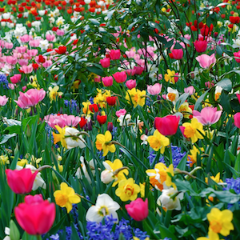

# Image Processing

> Image Processing assignment for CSCI 4471 Computer Graphics

## Author

- Glavin Wiechert

## Installation

1. Download and install [Processing](https://processing.org/).
2. Download / Clone this repository.
3. Follow [usage](#usage) below.

## Usage

### 1. Sample Image Creation

Run the [sketch_1_create_images]() script and it will generate images in your [original_images] directory.

To change the image size, you can change the `size(300,300)` call before running. The image size generated is the same as the Processing's display size.

### 2. Single-Image Manipulation

Run the [sketch_2_single_image_manipulation]() script.
It will load the images from [original_images] directory and allow you to view them with different manipulators.

#### Controls

- `UP` / `DOWN` - Change Manipulator of image
- `LEFT` / `RIGHT` - Change selected sample image
- `+` / `-` - Zoom in/out
- `r` - Reset zoom, etc

### 3. Multi-Image Manipulation

*Coming soon.*

## Features

List of implemented features to be graded.

### [✓] 1. Sample Image Creation

See https://github.com/Glavin001/image-processing/issues/1

- [✓] `Constant`: Set each pixel to a given constant intensity value.

    
    
    

- [✓] `White noise`: Set each pixel to a random float between 0 (dark) and 1 (bright), independent of every other pixel

    
    
    

- [✓] An `interesting noise`:

    - Step 0: Set all pixel values to 0.5

    - Step 1: Randomly choose 2 pixels in the image; note that they define a straight line

    - Step 2: For all pixels to the left of the line, increase their brightness by δ; for all pixels to the right of the line, decrease their brightness by δ.

    - Go back to step 1.
    Play around with different values of δ. What happens if you choose δ randomly on
    each iteration? What happens if you apply δ multiplicatively versus additively?

    Additively:

    
    
    

    Multiplicatively:

    
    
    

- [✓] `Photographs`: Load in a few photographs of your choice

    Sample photograph:

    

    You can easily load more by simply placing them in the [original_images]() directory.

- [✓] `Gaussian`: See http://en.wikipedia.org/wiki/Gaussian_function

    

    
    
    

- [✓] `Stripes`: Create an image filled with parallel lines. Can your stripe function take a parameter θ so that the stripes are at an orientation θ?

    
    
    

### [✓] 2. Single-Image Manipulation

See https://github.com/Glavin001/image-processing/issues/2

- [✓] 2.1 Brightness
- [✓] 2.2 Equalize
- [✓] 2.3 Normalize
- [✓] 2.4 Histogram
- [✓] 2.5 Quantization
- [✓] 2.6 Resizing

### [ ] 3. Multi-Image Manipulation

*Not yet implemented.*

